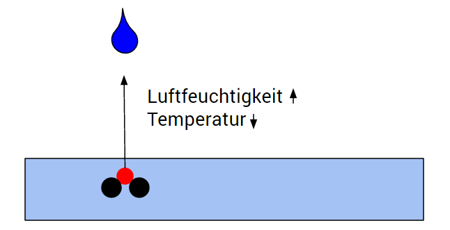
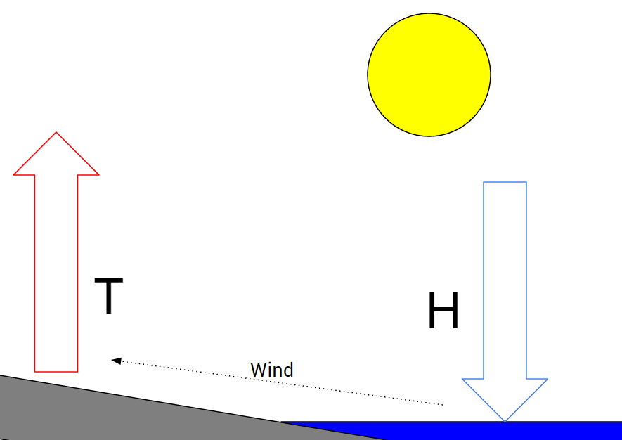

# Die Erde

Nachdem nun eine Möglichkeit besteht, die Sonneneinstrahlung in Abhängigkeit von Zeit und Ort zu ermitteln, sollen im Folgenden die Klimamechanismen auf der Erde erörtert werden.

Parameter des Systems sollen sein: 
- Temperatur in Celsius
- Luftfeuchtigkeit in %
- Luftdruck und Wind

## Temperatur
Die vorherrschende Temperatur ist von der Sonneneinstrahlung abhängig. Die Strahlungsenergie ist allerdings neben dem Höhenwinkel der Sonne (siehe [Die Sonne](die_sonne.md)) auch von der Bewölkung abhängig.
Trifft ein Sonnenstrahl auf eine Wolke von Wassermolekülen, gibt es vereinfacht betrachtet drei Möglichkeiten
1. Absorption: Der Sonnenstrahl wird komplett absorbiert, seine Energie regt das Molekül zum Schwingen an, es wird wärmer (Strahlungsenergie => Wärmeenergie)

2. Reflektion: Der Sonnenstrahl wird reflektiert, er verliert einen Teil seiner Energie (Frequenz ändert sich), die Umgebung erwärmt sich ein wenig und der Sonnenstrahl wird in eine andere Richtung abgelenkt

3. Verfehlung: Der Sonnenstrahl verfehlt die Moleküle und setzt seinen Weg unverändert fort

Für das Modell bedeutet das Folgendes: Wolken reduzieren die Strahlungsenergie der Sonne, heizen sich dabei allerdings auf.
Da es nicht zielführend war, einzelne Sonnenstrahlen und Wassermoleküle zu simulieren, wurde hier ein qualitativer Ansatz gewählt. Es wird nur beachtet, ob Wolken vorhanden sind oder nicht. Sind Wolken vorhanden gibt es zwei Parameter: Absorption und Reflektion. Trifft das Sonnenlicht auf eine Wolkenschicht, so wird der Anteil der Absorption und Reflektion abgezogen. Die übriggebliebene Energie wandert weiter nach unten wo sie entweder auf weitere Wolken oder den Boden trifft. Der Anteil der Absorption wird in Wärmeenergie umgerechnet, resultiert also in einem Temperaturanstieg.
Dieser Temperaturanstieg $$\Delta T$$ wird aus einem festgelegten Parameter $$\_e2t$$ ermittelt, da das Volumen der Wolken nicht bekannt ist. Der reflektierte Anteil wird ignoriert. Er gehört zu jener Energie, die ins Weltall abgestrahlt wird und damit das System verlässt.

Beispiel:
Sei Absorption $$a$$ und Reflektion $$r$$ 

$$\Delta T = (E_{Sonne} * a) * \_e2t$$

Die Energie, die im System verbleibt ($$E_{Sonne}^*$$): 
$$E_{Sonne}^* = E_{Sonne} * r$$

##Luftfeuchtigkeit
Luftfeuchtigkeit $$h$$ ist der Gehalt an Wasserdampf in der Luft. Die Luftfeuchtigkeit kann auf verschiedene Weisen bestimmt werden. Eine (die im Modell verwendete) ist das Verhältnis der Zahlen $$m$$ von Wasser- zu Luftmolekülen:
$$h = 100\frac{m_{Wasser}}{m_{Luft}}$$
Die Luftfeuchtigkeit steigt durch Verdunstung. Verdunstung ist, wenn Wassermoleküle die Oberflächenspannung überwinden und sich mit der darüber liegenden Luft vermischen. Das Überwinden der Oberflächenspannung entzieht der Umgebung Energie, welche sich dadurch abkühlt. [6, S. 42]

Die Umkehr zur Verdunstung ist Kondensation. Kondensation erhöht die Umgebungstemperatur, es bilden sich Wassertropfen in der Luft, die zu Boden fallen. Man spricht hierbei von Regen.
Im Modell wird Regen und Verdunstung sehr einfach dargestellt. Es wird eine Grenze in der Luftfeuchtigkeit $$ x $$ festgelegt:

Solange gilt $$ h<x $$:  
Temperatur wird um einen festen Parameter verringert, Luftfeuchtigkeit erhöht.

Wenn $$ h>=x $$: Die Temperatur wird um einen festen Parameter erhöht und die Luftfeuchtigkeit verringert. Es regnet.

Aus der Luftfeuchtigkeit resultieren Wolken. Wolken können entweder aus übersättigter Luft bestehen ($$ h > 100 \% $$) oder aus Eiskristallen ($$T<0^\circ und\ h>0 \% $$). Wolken die sich am Boden befinden nennt man Nebel. [6, S. 44 ff]

##Luftdruck und Wind
Wind ist bewegte Luft. Luft wird dann bewegt, wenn es einen Luftdruckunterschied auszugleichen gilt. Luftdruck verändert sich durch Erwärmung. Erwärmte Luft steigt nach oben, der Luftdruck an der Erdoberfläche sinkt, es entsteht ein Tiefdruckgebiet.
An anderen Stellen, z. B. über Wasser, ist die Temperatur an der Oberfläche niedrig. Die Luft ist kühl und sinkt Richtung Erdboden. Der Luftdruck an der Oberfläche steigt. Es entsteht ein Hochdruckgebiet.
Da in der Natur alles dem Ausgleich zustrebt, fließt Luft vom Hochdruckgebiet zum Tiefdruckgebiet. Es weht Wind. [6, S. 50 ff]

Im Modell wurde festgelegt, dass Wind nur von links nach rechts wehen kann. Wind weht damit nur dann zwischen zwei Biomen, wenn der Luftdruck im rechten Biom geringer ist als im linken. 
Der Luftdruck wird aus dem Temperaturunterschied ermittelt.
Es gilt die Annahme, dass beide Biome dasselbe konstante Volumen haben, dadurch handelt es sich um einen isochoren Vorgang. 

Damit gilt: $$\frac{T}{p} = const$$ wobei $$T$$ die Temperatur und $$p$$ der Luftdruck ist.

Daraus kann abgeleitet werden:

$$p_1 = \frac{p_2*T_1}{T_2}$$

und

$$p_2 = \frac{p_1*T_2}{T_1}$$

da 

$$\frac{p_2}{p_1} = \frac{T_2}{T_1}$$

außerdem:

$$\Delta p = p_1 - p_2 $$  
da der Luftdruck im ersten Biom immer größer ist als im zweiten, da sonst kein Wind berechnet werden würde, denn Wind von rechts nach links ist verboten.

damit gilt:

$$\Delta p = p_1 - \frac{p_1*T_2}{T_1}$$

$$\Delta p = \frac{p_1*(T_1 - T_2)}{T_1}$$

Der Luftdruckunterschied ist also abhängig von den Temperaturen in beiden Biomen und dem initialen Luftdruck. Der genaue Betrag von $$\Delta p$$ ist allerdings im Modell nicht relevant, da nur entschieden wird ob Wind weht oder nicht. Deswegen kann $$p_1$$ durch die konstante $$1$$ ersetzt werden. Damit gilt dann:

Wind weht wenn:

$$\frac{T_1 - T_2}{T_1}>0$$

