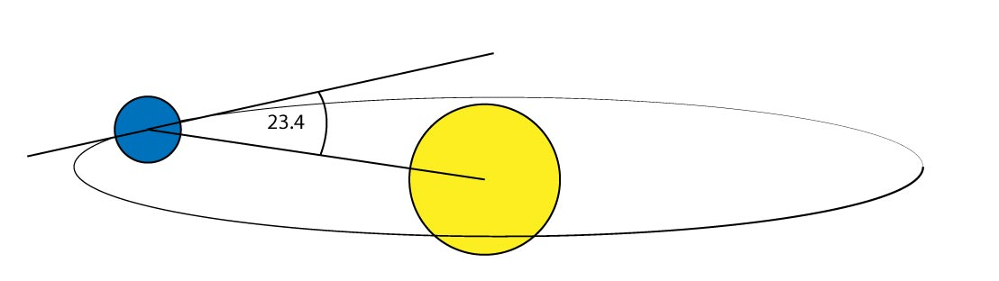

# Die Sonne

Das Wetter eines jeden Planeten ist abhängig vom Zentralgestirn, welches er Umkreist. Im Falle der Erde ist das die Sonne. Die Erde umkreist die Sonne annähernd Kreisförmig. An der entferntesten Stell, dem sogenannten Aphel sind das $$152 * 10^9 m$$. Am Perihel, die Position an der die Sonne der Erde am nächsten ist, sind es $$147 * 10^9 m$$.
Die durchschnittlich wirkende Leistung in Form von Strahlung ist von der Entfernung unabhängig. Misst man von einem Satelliten die eintreffende Strahlung erhält man den Durchschnittswert von $$1367 \frac{W}{m^2}$$ (3). 
Die unterschiedlichen Klimazonen sowie das Wechsel der Jahreszeiten liegt an der Neigung der Äquatorebne zur Bahnebene des Orbits. Diese beträgt etwa 23.4 Grad. Man spricht hierbei von der Ekliptik.

