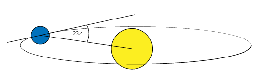
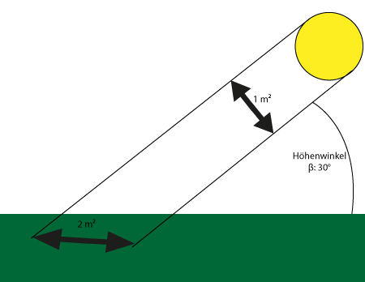
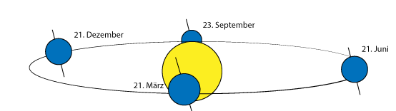

# Die Sonne

Das Wetter eines jeden Planeten ist abhängig vom Zentralgestirn, welches er umkreist. Im Falle der Erde ist das die Sonne. Die Erde umkreist die Sonne annähernd kreisförmig. An der entferntesten Stelle, dem sogenannten Aphel sind das $$152 * 10^9 m$$. Am Perihel, die Position an der die Sonne der Erde am nächsten ist, sind es $$147 * 10^9 m$$.
Die durchschnittlich wirkende Leistung in Form von Strahlung ist von der Entfernung annähernd unabhängig. Misst man von einem Satelliten die eintreffende Strahlung, erhält man den Durchschnittswert von $$1367 \frac{W}{m^2}$$ (3). 
Die unterschiedlichen Klimazonen, sowie der Wechsel der Jahreszeiten, liegt an der Neigung der Äquatorebene zur Bahnebene des Orbits. Diese beträgt etwa $$23.4 ^\circ$$. Man spricht hierbei von der Ekliptik.

Das Resultat der Ekliptik ist, dass die Sonnenstrahlen schief auf die Erde auftreffen, da vom Boden aus betrachtet die Sonne in Abhängigkeit von Breitengrad und Jahreszeit unterschiedlich hoch am Himmel steht.
Dadurch, dass die Sonnenstrahlen schief auftreffen, wird die Energie aus $$1m^2$$ Sonnenstrahl auf eine größere Fläche am Boden verteilt. Je niedriger die Sonne am Horizon steht, desto geringer ist die Energie pro $$m^2$$.

Im vorliegenden Beispiel beträgt der Winkel der Sonne am Horizont (Höhenwinkel $$\beta$$) $$30^\circ$$.
Mit Hilfe des Sinus kann man die Strahlung pro Quadratmeter am Boden berechnen:

$$ E_{Boden} = E_0 * \sin(\beta)$$ 
$$ E_{Boden} = 1367 \frac{W}{m^2}* \sin(30 ^\circ)$$ 
$$ E_{Boden} = 683.5\frac{W}{m^2}$$

## Ekliptik $$\epsilon$$ und die Jahreszeiten

Der Höhenwinkel der Sonne ändert sich über das Jahr. Grund dafür ist, dass während die Erde ihre Bahn um die Sonne zieht, sich die Ausrichtung der Erdachse gegenüber der Sonne ändert.

Man kann die Ekliptik mit einer Formel vom letzten Standardäquinoktium (J2000.0) berechnen: 
$$\epsilon = 23.439^\circ - 0.0000004^\circ * n$$

$$n$$ ist die Anzahl der Tage seit dem letzten Standardäquinoktium.

In JavaScript kann man $$n$$ folgendermaßen berechnen:

    function n(){
      var san = 946728000,//Timestamp des Standardäquinoktikums: 946728000
          secondsOfDay = 86400; //Tag in Sekunden: 60 * 60 *24 = 86400
      return (new Date().getTime() - san) / secondsOfDay;
    }

Neben der Ekliptik ist der Höhenwinkel außerdem abhängig vom Breitengrad $$\varphi $$ und dem Stundenwinkel $$\tau$$. 
Die Beziehung ist:
$$h = \arcsin(\cos(\delta) * \cos(\tau) * \cos(\varphi) + \sin(\delta) * \sin(\varphi)) $$

Wobei gilt: 
$$\delta $$: Die Deklination ist, diese ergibt sich aus dem $$\arcsin$$ der Ekliptik $$\epsilon$$ und der ekliptikale Länge der Sonne $$\lambda$$. 
$$\delta  = \arcsin(\sin(\varepsilon) * \sin(\lambda)) $$

wobei: 
$$\lambda = 280,460^\circ + 0,9856474^\circ * n + 1,915^\circ * \sin(357,528^\circ + 0,9856003^\circ \cdot n) + 0,01997^\circ * \sin(2 * 357,528^\circ + 0,9856003^\circ * n)$$

$$\varphi$$ der Breitengrad ist.

$$\tau$$ ist der Stundenwinkel der Sonne, dieser ergibt sich aus der Sonnenzeit. Die Sonnenzeit ist eine vereinheitlichte Zeit, befreit von Zeitzonen und Sommerzeit. 

Nach dieser Zeit bewegt sich die Sonne (von der Erde aus betrachtet) pro Stunde um $$15 ^\circ$$ pro Stunde in Richtung Westen.

Der Stundenwinkel ist also der Stand der Sonne zu Position eines Beobachters auf der Erde, wenn die Ebene auf der der Winkel gemessen wird sich aus der Bahn der Sonne ergibt. Mit Hilfe einer Sonnenuhr kann aus diesem Winkel die Zeit ermittelt werden, deswegen auch der Name Stundenwinkel.

Den Stundenwinkel kann man folgendermaßen ermitteln:
$$\tau = \theta - \alpha$$
$$\alpha$$ ist die Rektazension die sich aus der Ekliptik und der ekliptikale Länge der Sonne $$\lambda$$ ergibt:

$$\alpha = \arctan( \frac{\cos(\varepsilon)* \sin(\lambda)}{\cos(\lambda)})$$

$$\theta$$ ist der Schnittpunkt des Himmelsäquators mit der Ekliptik, auch Frühlingspunkt genannt. Diesen ermittelt man aus dem Zeitunterschied der aktuellen Zeitzone mit Greenwich 
in Stunden ($$utcOffset$$) multipliziert mit $$15 ^\circ$$ und der der ekliptikale Länge der Sonne $$\lambda$$.

$$\theta = 15^\circ * utcOffset + \lambda$$

