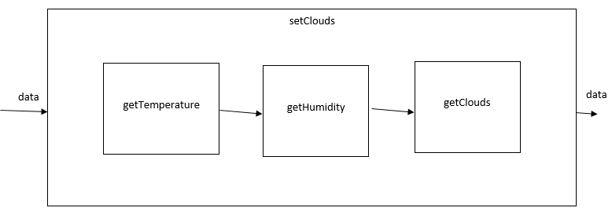

# Funktionale Programmierung

Wenn man das vorliegende System in seine kleinsten Bestandteile zerlegt, kommt man zu dem Ergebnis, dass es sich um eine komplexe Kombination von mathematischen Funktionen handelt.

Diese Funktionen werden der Reihe nach ausgeführt.

mathematische Darstellung: 
$$ f_{gesamt}(x) = 9 * (x+5)$$ 
kann unterteilt werden in zwei Funktionen: 
$$f_1(x) = x + 5$$ 
und 
$$f_2(x) = 9*x$$ 
$$ f_{gesamt}(x) = f_2(f_1(x))$$

Als System betrachtet:

Komplexe Systeme können auf diese Weise in einfachste Blöcke zerlegt und aneinandergereiht werden. Man könnte diesen Vorgang auch in JavaScript implementieren:

    function one(x){
      return x + 5;
    }
    function two(x){
        return 9 * x;
    }
    
    function gesamt(x){
        return two(one(x));
    }
    
    /*
     * oder eleganter:
     */
    var gesamt = _.compose(one, two);

Man nehme ein Beispiel aus dem Modell:

Um zu ermitteln ob es bewölkt ist, wird die aktuelle Temperatur und Luftfeuchtigkeit benötigt

    function getTemperature(data){
      var e_sun = getSun(data); //die Sonnenstrahlung an diesem Ort
      
      /*
       * die Temperaturänderung wird anhand der Konstante _e2t 
       * aus der Strahlungsenergie berechnet
       */
      data.temperature += e_sun * _e2t;
      
      /*
       * data enthält die gesamten Daten eines jeden Biomes
       */
      return data;
    }
    
    //Die Luftfeuchtigkeit wird in einer festen Rate aus der Temperatur berechnet
    function getHumidity(data){
      data.temperature -= _t2h;
      data.humidity += _t2h;
    }
    
    //Ob das Biom bewölkt ist wird anhand der Luftfeuchtigkeit und der Temperatur festgelegt
    function getClouds(data){
        data.cloudy = (data.temperature < 0 && data.humidity > 0) || data.humidity >= 100;
        return data;
    }
    
    //Das System zum erstellen von Wolken wird erstellt
    var setClouds = _.compose(getClouds, getHumidity, getTemperature);
    //und ausgeführt
    setClouds();
    
    
Zum Vergleich, das Systembild sähe folgendermaßen aus:

Geht man noch einen Schritt zurück, kann dieses Subsystem `setClouds` mit anderen Subsystemen zu einem weiteren Subsystem zusammengefasst werden:

    /* Das gesamte Biom wird berechnet. 
     * Zuerst wird der Wind getestet, wenn Wind aus dem vorherigen Biom weht, 
     * werden die Daten entsprechend angepasst (manipulate). 
     * Anschließend wird der im aktuellen Biom angepasst.
     * Dann werden die Wolken ermittelt und ob es regnet. 
     * Beide Subsysteme aktualisieren Temperatur und Luftfeuchtigkeit. 
     * Anschließend wird anhand der Werte die Art des Bioms ermittelt 
     * (Wiese, Wald, Sumpf etc.) und ggf. geändert.
     * Zuletzt wird das nächste computeBiome für das nächste Biom aufgerufen.
     */
    
    var computeBiome = _.compose(next, setBiom, setRain, setClouds, setWind, manipulate);
    
    
    /*
     * Um einen Stack overflow zu vermeiden wird computeBiome 
     * als callback von setInterval aufgerufen. 
     * setInterval ruft eine Funktion immer auf, wartet aber mit dem Aufruf bis eine
     * festgelegte Zeit vergangen ist (in diesem Fall 0ms) und dass der Stack leer ist.
     * Damit wird gewährleistet, dass die Simulation für alle Biome abgeschlossen ist, 
     * bevor eine neue gestartet wird.
     */
    setInterval(function(){
      /*
       * seedData sind willkürliche festgelegte Daten 
       * eines virtuellem erstem Bioms.
       */
      computeBiome(seedData)
    }, 0);

    