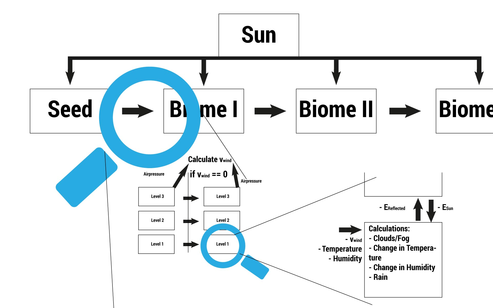

# Das System

Im Folgenden soll das Klima aus systemtheoretischer Sicht betrachtet werden. Dazu müssen vorher einige Begrifflichkeiten geklärt werden:
* **Knoten:** Jedes System besteht aus Knoten, welche eigenständige Elemente sind und Verbindungen zwischen den Knoten. Das vorliegende System besteht nur aus Subsystemen und Elementen.
* **Elementen:** Hat Ein- und Ausgänge und interne Logik und Eigenschaften. Im vorliegenden System sind die Höhenlevel die Elemente. Sie interagieren mit der Umwelt und haben eine interne Logik. Man kann hierbei auch von Agenten sprechen.
* **Subsystem:** Ein Subsystem kann entweder eine Anordnung von Systemen sein (z. B.: Ein Biom (Subsystem) besteht aus drei Leveln (Subsystem)) oder ein System bestehend einzelnen Elementen.
* **Gesamtsystem:** Das Gesamtsystem ist die Summe aller Subsysteme. In diesem Fall alle Biome.

## Das Biom
Ein Biom ist ein virtuelles Gebiet mit eine bestimmten Fläche. Jedes Biom wurde in drei Höhenlevel unterteilt: 
- Level 1: Der Boden.
- Level 2: Untere Atmosphäre (ca. 3000 m)
- Level 3: Obere Atmosphäre (ca. 7000 m)

Jedes Level hat eigene klimatische Bedingungen, die sich auf die unteren Level auswirken können:
- Bewölkung: Dämpft das Sonnenlicht
- Regen: Erhöht das Grundwasser am Boden

Die Level interagieren mit den Leveln der des anschließenden Bioms, sofern Wind weht. Diese Interaktion findet immer auf gleicher Höhe statt: z. B. Level 1 => Level 1, Level 2 => Level 2 etc.

## Das Gesamtsystem
Das Gesamtsystem hat mehrere Ebenen. In der obersten Ebene wird die Interaktion der Biome beschrieben. Zur Vereinfachung sind die Biome nur eindimensional angeordnet.
Die eintreffende Strahlungsenergie der Sonne ist abhängig von Position und Zeit. Zur Vereinfachung wird angenommen, dass sich alle Biome auf demselben Breiten und Längengrad befinden.

Eine weitere Vereinfachung ist, dass die Interaktion der Biome nur von Westen nach Osten erfolgen kann (der Wind weht nur von Westen nach Osten).
Das Resultierende System kann wie folgt abgebildet werden:

Am Anfang steht ein sogenanntes Seed-Biome. Die Eigenschaften dieses Biomes werden am Anfang zufällig gesetzt. 
Jedes Biome besteht aus drei Elementen. Eines in großer Höhe, eines in mittlerer Höhe und eines am Boden.

Die Agenten selbst haben zwei Ein- und Ausgänge. Der eine ist für die Aufnahme und Abgabe von Strahlungsenergie zuständig. Der andere nimmt die durch den Wind herangetragenen Eigenschaften des vorherigen Biomes an bzw. gibt sie an das nächste Biom weiter.

Die Elemente jedes Biomes interagieren über den Wind mit dem der Höhe entsprechenden nächstem Biom. Wenn auf der entsprechenden Höhe zwischen zwei Biomen Wind weht ($$v_{wind} > 0$$), beeinflussen die Eigenschaften des vorherigen Biomes die des nächsten.

Aus den herangetragenen Werten wird mit Hilfe der internen Logik der momentane Ist-Zustand ermittelt. Anschließend werden dem Ist-Zustand entsprechend die Werte der Ausgänge gesetzt.
Jedes Element kann auf die Werte der benachbarten Elemente zugreifen und entscheidet nach festgelegten Regeln ob es die Werte aufnimmt:
z. B.:

| Biome 1 - Level 1 | Biom 2 - Level 1 |
| -- | -- |
| Luftdruck: 1200 | Luftdruck: 1000 |
| Temperatur: 28 | Temperatur: 25  |

Biom 2 ermittelt:
$$Luftdruck_{B1L1}>Luftdruck_{B2L1} => v_{wind}>0$$
Da der Luftdruck in Biom 1 höher ist als in Biom 2, weht Wind. 
Daraus folgt, dass die Temperatur aus Biom 1 die Temperatur in Biom 2 beeinflusst (in diesem Fall erhöht).

## Nähere Betrachtung
Bei dem vorliegenden System handelt es sich um ein komplexes vernetztes System, da es diverse Eigenschaften hat die komplexen System entsprechend, auch wenn es noch keine eindeutige Definition für komplexe vernetzte Systeme gibt [1].

Zum einen ist es **chaotisch**. Ein chaotisches System ist zwar deterministisch, der Ausgang ist aber sehr stark von den Anfangswerten abhängig. Kleinste Ungenauigkeiten (z. B. Rundungsfehler) verändern das Ergebnis so stark, dass Vorhersagen über den Ausgang, nach einer größeren Zeitspanne, unmöglich sind[2]. Je weiter ein Biom vom Startpunkt (Seed-Biom) entfernt ist, desto chaotischer ist dessen Zustand.

Desweiteren ist es **nichtlinear**. Nichtlineare Systeme sind dynamischen Systemen konzeptuell ähnlich. Dynamische Systeme sind vergleichbar mit Objekten, deren Status sich über Zeit gemäß dynamischen Regeln entwickelt. Diese Regeln sind deterministische Entwicklungsoperatoren, d. h. Zufall spielt in einem solchen System keine Rolle [3].

